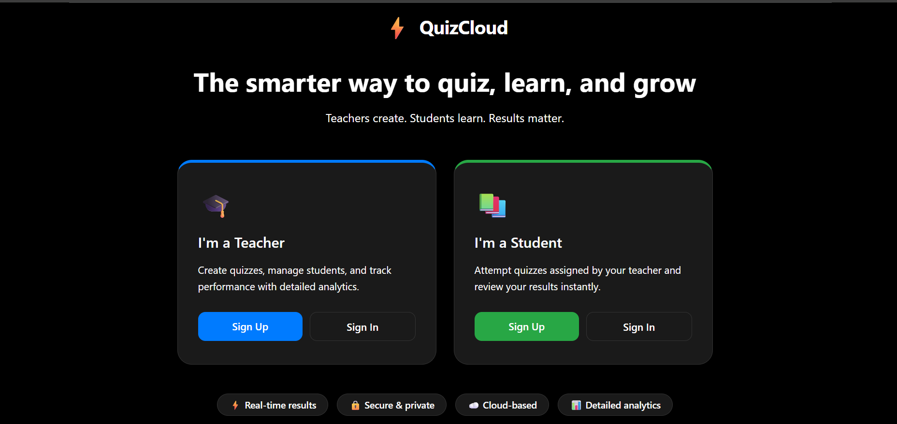
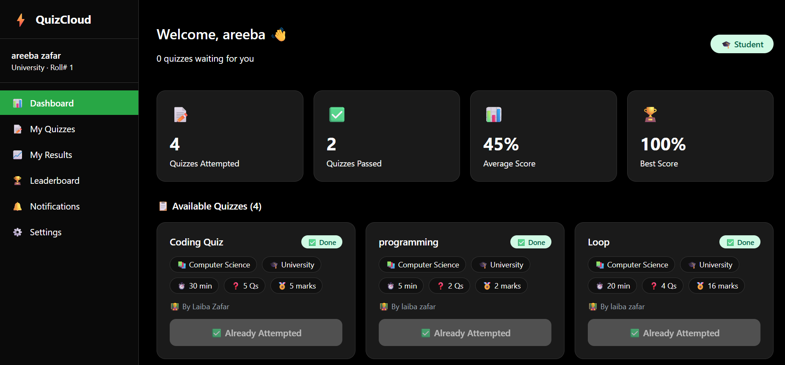
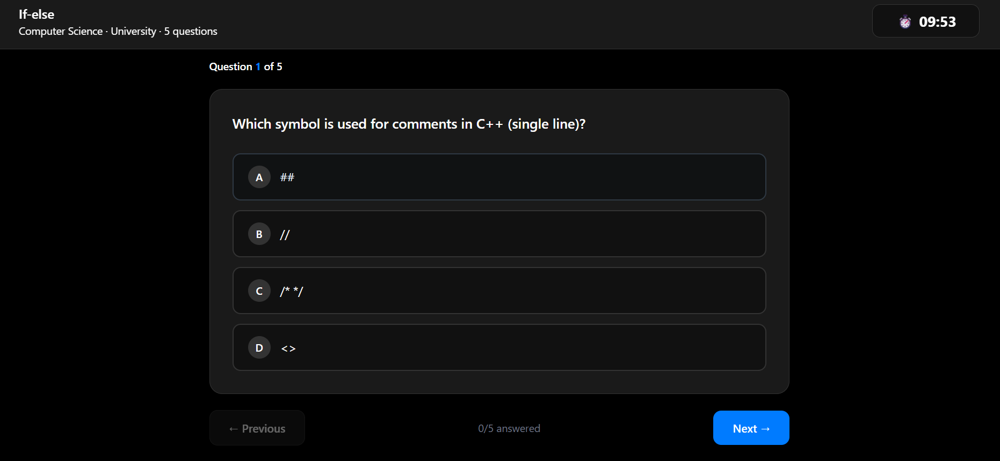
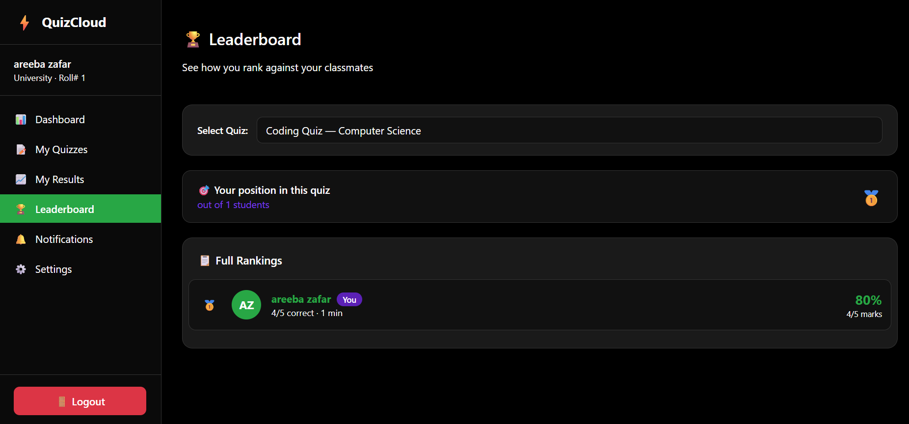
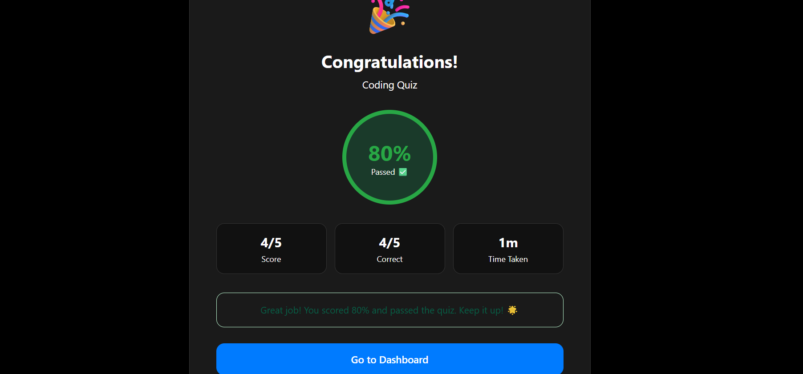

<div align="center">


<br/>

[](https://git.io/typing-svg)

<br/>


<br/>

> **QuizCloud** is a full-stack cloud-based quiz platform where teachers create quizzes and students attempt them online — with real-time results, leaderboards, and analytics, all powered by Firebase.

<br/>

[🚀 Live Demo](https://quizcloud-app.vercel.app) &nbsp;•&nbsp; [📸 Screenshots](#-screenshots) &nbsp;•&nbsp; [⚙️ Installation](#️-installation) &nbsp;•&nbsp; [📖 Features](#-features)

<br/>

</div>

---

## 📌 Table of Contents

- [✨ Features](#-features)
- [📸 Screenshots](#-screenshots)
- [🛠️ Tech Stack](#️-tech-stack)
- [📁 Project Structure](#-project-structure)
- [⚙️ Installation](#️-installation)
- [🔥 Firebase Setup](#-firebase-setup)
- [🗄️ Database Structure](#️-database-structure)
- [🚀 Deployment](#-deployment)
- [👥 Group Members](#-group-members)
- [📄 License](#-license)

---

## ✨ Features

### 👨‍🏫 Teacher Portal

| Feature | Description |
|---------|-------------|
| 🔐 **Secure Auth** | Role-based signup & login with Firebase Authentication |
| 📊 **Live Dashboard** | Real-time stats — quizzes, students, scores & activity feed |
| 📝 **Quiz Builder** | Create quizzes with MCQ, True/False & Short Answer questions |
| 🗂️ **Question Bank** | Save, tag & reuse questions across multiple quizzes |
| 📋 **My Quizzes** | Manage all quizzes with search, filter & expandable questions |
| 📈 **Analytics** | Class stats, top performers, pass/fail charts & CSV export |
| 👨‍🎓 **Students** | Monitor all students with performance scores & grade filters |
| 🔔 **Notifications** | Send typed announcements to students with audience control |
| ⚙️ **Settings** | Update profile, change password & configure preferences |

### 📚 Student Portal

| Feature | Description |
|---------|-------------|
| 🔐 **Secure Auth** | Role-based signup & login with Firebase Authentication |
| 📚 **Dashboard** | View available quizzes & personal performance stats |
| 📝 **My Quizzes** | See pending & attempted quizzes with result history |
| ⏱️ **Live Quiz Engine** | Timed quiz with countdown, navigation dots & progress bar |
| 🚫 **Anti-Cheat** | Tab-switch detection with 3-strike auto-submission system |
| 📊 **My Results** | Complete attempt history with scores & pass/fail status |
| 🏆 **Leaderboard** | Class rankings with gold/silver/bronze podium display |
| 🔔 **Notifications** | Receive teacher alerts with read/unread tracking |
| ⚙️ **Settings** | Update profile, change password & configure preferences |

---

## 📸 Screenshots

### 🏠 Landing Page


### 🎓 Teacher Dashboard


### 📝 Quiz Builder


### 📚 Student Dashboard


### ⏱️ Live Quiz Engine


### 🏆 Leaderboard


### 📊 Results & Analytics



---

## 🛠️ Tech Stack

```
⚛️  Frontend     →  React.js 18 + React Router DOM v6
🔥  Backend      →  Firebase (Auth + Firestore)
☁️  Database     →  Cloud Firestore (NoSQL)
🔐  Auth         →  Firebase Authentication (JWT)
🎨  Styling      →  Pure CSS3 (Custom Design System)
🔔  Toast        →  React Hot Toast
🚀  Deployment   →  Vercel (Global CDN)
📦  Version      →  GitHub
```

<div align="center">


</div>

---

## 📁 Project Structure

```
quizcloud-app/
│
├── 📁 public/
│
├── 📁 src/
│   ├── 📁 firebase/
│   │   └── config.js                    # Firebase initialization
│   │
│   ├── 📁 context/
│   │   └── AuthContext.jsx              # Global auth state & functions
│   │
│   ├── 📁 components/
│   │   ├── 📁 auth/
│   │   │   ├── TeacherSignup.jsx
│   │   │   ├── TeacherLogin.jsx
│   │   │   ├── StudentSignup.jsx
│   │   │   └── StudentLogin.jsx
│   │   │
│   │   ├── 📁 teacher/
│   │   │   ├── Sidebar.jsx
│   │   │   ├── 📁 quiz/
│   │   │   │   ├── QuizDetails.jsx
│   │   │   │   ├── AddQuestion.jsx
│   │   │   │   ├── QuestionCard.jsx
│   │   │   │   └── QuestionBankPicker.jsx
│   │   │   └── 📁 results/
│   │   │       ├── ResultsStats.jsx
│   │   │       └── ResultsTable.jsx
│   │   │
│   │   └── 📁 student/
│   │       ├── StudentSidebar.jsx
│   │       ├── StudentStats.jsx
│   │       ├── AvailableQuizzes.jsx
│   │       └── 📁 quiz/
│   │           ├── QuizTimer.jsx
│   │           ├── QuizQuestion.jsx
│   │           └── QuizResult.jsx
│   │
│   ├── 📁 pages/
│   │   ├── LandingPage.jsx
│   │   ├── 📁 teacher/
│   │   │   ├── TeacherDashboard.jsx
│   │   │   ├── MyQuizzes.jsx
│   │   │   ├── Students.jsx
│   │   │   ├── QuestionBank.jsx
│   │   │   ├── Notifications.jsx
│   │   │   ├── Settings.jsx
│   │   │   ├── 📁 quiz/
│   │   │   │   └── CreateQuiz.jsx
│   │   │   └── 📁 results/
│   │   │       └── QuizResults.jsx
│   │   │
│   │   └── 📁 student/
│   │       ├── StudentDashboard.jsx
│   │       ├── MyQuizzes.jsx
│   │       ├── MyResults.jsx
│   │       ├── Leaderboard.jsx
│   │       ├── Notifications.jsx
│   │       ├── Settings.jsx
│   │       └── 📁 quiz/
│   │           └── AttemptQuiz.jsx
│   │
│   ├── 📁 styles/
│   │   ├── auth.css
│   │   ├── notifications.css
│   │   ├── settings.css
│   │   ├── 📁 teacher/
│   │   └── 📁 student/
│   │
│   ├── App.jsx                          # Main routes
│   └── index.js                         # Entry point
│
├── .env                                 # 🔒 Firebase keys (NOT in repo)
├── .gitignore
├── package.json
└── README.md
```

---

## ⚙️ Installation

### Prerequisites
- ✅ Node.js v16+ installed
- ✅ Firebase account
- ✅ Git installed

### Steps

**1️⃣ Clone the repository**
```bash
git clone https://github.com/YOUR_USERNAME/quizcloud-app.git
cd quizcloud-app
```

**2️⃣ Install dependencies**
```bash
npm install
```

**3️⃣ Create environment file and add Firebase keys**
```env
REACT_APP_FIREBASE_API_KEY=your_api_key
REACT_APP_FIREBASE_AUTH_DOMAIN=your_project.firebaseapp.com
REACT_APP_FIREBASE_PROJECT_ID=your_project_id
REACT_APP_FIREBASE_STORAGE_BUCKET=your_project.appspot.com
REACT_APP_FIREBASE_MESSAGING_SENDER_ID=your_sender_id
REACT_APP_FIREBASE_APP_ID=your_app_id
```

**4️⃣ Start the app**
```bash
npm start
```

🎉 App runs at **http://localhost:3000**

---

## 🔥 Firebase Setup

1. Go to [Firebase Console](https://console.firebase.google.com)
2. Create a new project named `QuizCloud`
3. Enable **Email/Password** Authentication
4. Create a **Firestore Database** in test mode
5. Register a Web App and copy config keys to `.env`
6. Add Firestore Security Rules from the project documentation

---

## 🗄️ Database Structure

```
📦 Firestore Database
│
├── 👤 users/{uid}
│   ├── name, email, role
│   ├── subject, school          → Teacher fields
│   └── grade, rollNumber        → Student fields
│
├── 📝 quizzes/{quizId}
│   ├── title, subject, grade
│   ├── timeLimit, totalMarks
│   ├── questions[]
│   └── status, teacherId
│
├── 📊 attempts/{attemptId}
│   ├── studentId, quizId
│   ├── score, percentage
│   ├── passed, timeTaken
│   └── tabWarnings, answers{}
│
├── 🗂️ questionbank/{questionId}
│   ├── type, text, options[]
│   ├── subject, difficulty
│   └── tags, teacherId
│
└── 🔔 notifications/{notifId}
    ├── title, message, type
    ├── audience, senderId
    └── readBy[]
```

---

## 🚀 Deployment

Deployed on **Vercel** for free with automatic HTTPS and global CDN.

```bash
# Install Vercel CLI
npm install -g vercel

# Deploy
vercel
```

> ⚠️ Add Firebase environment variables in **Vercel Dashboard → Settings → Environment Variables**


</div>


---

## 📄 License

This project is licensed under the **MIT License** — feel free to use, modify and distribute.

---

<div align="center">

### ⭐ If you found this project helpful, please give it a star!


</div>
